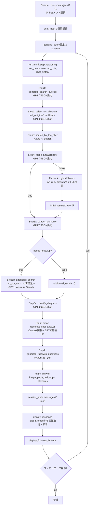

# アプリケーション処理フロー詳細図

対象: ドキュメント選択後から最終回答表示・フォローアップまでの全処理

## 全体フロー概要（Mermaid）

---

## Phase 0: Sidebar ドキュメント選択

| 項目 | 内容 |
|------|------|
| **参照ファイル** | `documents.json`（ローカル） |
| **処理** | `load_documents_catalog()` で `[{documentNumber, documentTitle}]` を読み込み、multiselect に表示 |
| **出力** | `selected_pdfs`：`["All Documents"]` または `documentNumber` のリスト |

## Phase 1: ユーザー入力 & トリガー

| 項目 | 内容 |
|------|------|
| **トリガー** | `st.chat_input()` で質文送信 |
| **処理** | `st.session_state.pending_query = prompt` → `st.rerun()` |

## Phase 2: pending_query 処理開始

| 項目 | 内容 |
|------|------|
| **処理** | 1. `pending_query` を `session_state.messages` に `{"role":"user","content":pending}` 追加 2. `chat_history_for_gpt = session_state.messages[:-1]`（現在のユーザーメッセージ除く） 3. `run_multi_step_reasoning(pending, selected_pdfs, chat_history_for_gpt)` 実行 |

---

## Phase 3: Step 1 — Search Query Generation

**関数**: `step1_generate_search_queries(user_query)`

| 項目 | 内容 |
|------|------|
| **目的** | ユーザーの生の質問から、Azure AI Search 用の検索クエリを生成・識別子抽出 |
| **GPT使用** | ✅ JSONモード |
| **System Prompt** | `You are a search query extraction assistant.` |
| **User Prompt変数** | `user_query`（生の質問文） |
| **出力** | `{"queries": [...], "has_codes": true/false}` |
| **エラー時** | `{"queries": [user_query], "has_codes": False}` でフォールバック |

---

## Phase 4: Step 2 — Select Relevant TOC Chapters

**関数**: `step2_select_toc_chapters(queries, user_query, pdf_filter_paths)`

| 項目 | 内容 |
|------|------|
| **目的** | `md_out_toc/*.md` から関連する章タイトルを最大10件選定 |
| **GPT使用** | ✅ JSONモード |
| **System Prompt** | `You are a technical manual chapter selection assistant.` |
| **参照ファイル** | **`md_out_toc/*.md`**（ローカルディレクトリ） |
| **ファイル読込詳細** | `_load_toc_markdown(toc_dir="md_out_toc", document_numbers=pdf_filter_paths)` - `"All Documents"` / `None` → `glob.glob("md_out_toc/*.md")` で全ファイル読込 - 特定 `documentNumber` → `md_out_toc/{num}.md` のみ（例: `SEN06867-11.md`） - 複数ファイルを `\n\n` で連結 |
| **User Prompt変数** | `user_query`, `queries_json`（Step1結果）, `toc_content`（上記全文） |
| **出力** | `chapters` リスト（章タイトルの文字列配列） |
| **エラー時** | `toc_content` 空なら警告 → `[]` |

---

## Phase 5: Step 3 — Search by TOC Filter

**関数**: `step3_search_by_toc_filter(toc_titles, pdf_filter_paths)`

| 項目 | 内容 |
|------|------|
| **目的** | 選定された章タイトルで Azure AI Search をフィルタ検索 |
| **GPT使用** | ❌ 不使用 |
| **外部API** | **Azure AI Search** (`get_search_client()`) |
| **検索詳細** | 1. TOC等値フィルタ構築: `(TOC eq 'A' or TOC eq 'B' or ...)` 2. `documentNumber` フィルタと AND 結合（`selected_pdfs` 指定時） 3. `search_text="*"`、フィルタのみで検索 4. `batch_size=1000` でページング（skip+top）して全件網羅 5. 取得フィールド: `SEARCH_FIELDS`（`id, TOC, path, content, fileName, start_page, end_page, image_content, same_page_paths, documentNumber, documentTitle, documentType, language`） |
| **出力** | `initial_results`（Azure AI Search結果リスト） |

---

## Phase 6: Step 4 — Answerability Judgment

**関数**: `step4_judge_answerability(user_query, queries, search_results)`

| 項目 | 内容 |
|------|------|
| **目的** | `initial_results` の内容でユーザーの質問に答えられるか判定 |
| **GPT使用** | ✅ JSONモード |
| **System Prompt** | `You are a document relevance judge.` |
| **User Prompt変数** | `user_query`, `queries_json`, `context`（initial_results先頭10件のcontentを章別に連結） |
| **出力** | `{"answerable": true/false, "reason": "..."}` |

### Phase 6b: Fallback Hybrid Search（`answerable = false` の場合のみ）

**関数**: `run_multi_step_reasoning()` 内フォールバック → `search_documents()`

| 項目 | 内容 |
|------|------|
| **目的** | TOC検索不十分時、ベクトル+ハイブリッド検索で追加結果取得 |
| **GPT使用** | ❌ 不使用 |
| **外部API** | **Azure AI Search** + **Text Embeddings API** (`get_text_embeddings_client()`) |
| **検索詳細** | - `queries` 各要素に対して `search_documents(q, pdf_filter_paths, top=5)` 実行 - 各クエリで `generate_text_embedding()` → `VectorizedQuery`（k=5, fields=`contentVector,imageSummaryVector`）生成 - テキスト+ベクトルハイブリッド検索 - `documentNumber` フィルタ同時適用 - `id` で重複排除後、`initial_results` に追加統合 |
| **遷移** | → Phase 7（Step 5a）へ |

---

## Phase 7: Step 5a — Extract Elements with GPT

**関数**: `extract_elements_with_gpt(initial_results, user_query, chat_history)`

| 項目 | 内容 |
|------|------|
| **目的** | 取得結果から深掘り要素を抽出し、追加検索の要否を判定 |
| **GPT使用** | ✅ JSONモード |
| **System Prompt** | `You are an expert in analyzing technical documents. Extract elements written in both Japanese and English.` |
| **User Prompt変数** | `user_query`, `text_context`（initial_resultsのcontent全文連結）, `chat_history`（直近4ターン） |
| **抽出対象** | `error_codes`, `connectors`, `reference_chapters`, `diagnostic_chapters`, `components`, `reasoning`, `needs_followup` |
| **後処理（Python）** | - 正規表現で `text_context` から「see/refer to/〜を参照」等を再抽出 → `reference_chapters` に追加 - `found_titles` に既存の `error_codes` は除外 |
| **出力** | `elements` 辞書 |
| **場合分け** | `elements.needs_followup=true` → Phase 8 / `false` → Phase 9（`additional_results=[]`） |

判定方針（重要）:
- ユーザー質問が故障診断/点検/トラブルシュート/Failure Code（例: `CA441`）を含む場合は、原則 `needs_followup=true` とし Phase 8 を実行する。
- 純粋な手順確認などで深掘り不要な場合のみ `needs_followup=false` とし Phase 9 に進む（`additional_results=[]`）。

---

## Phase 8: Step 5b — Additional Search

**関数**: `search_additional_documents(elements, pdf_filter_paths)`

| 項目 | 内容 |
|------|------|
| **目的** | 抽出要素に基づき追加章を選定・検索 |
| **GPT使用** | ✅ JSONモード（章選定部分） |
| **System Prompt** | `You are a technical manual chapter selection assistant.`（Step2と同一） |
| **参照ファイル** | **`md_out_toc/*.md`**（`_load_toc_markdown()` で再読込） |
| **処理詳細** | 1. `elements` から追加クエリ構築: 　- `error_codes` → `"エラーコード：{code}"` 　- `connectors` → `"CONNECTOR list and layout"` 　- `reference_chapters/diagnostic_chapters` → `"追加検索するTOC：{title}"` 　- `components` → `"コンポーネント：{comp}"` 2. 重複排除 3. `md_out_toc/*.md` 再読込 → GPTに送信 → 追加章（最大50件）選定 4. `step3_search_by_toc_filter()` で Azure AI Search 実行 5. 結果に `_search_type="additional_toc"` タグ付与 |
| **出力** | `additional_results` |

---

## Phase 9: Step 5c — Chapter Classification

**関数**: `classify_chapters_with_gpt(initial_results, additional_results, user_query)`

| 項目 | 内容 |
|------|------|
| **目的** | 取得した全章を `MAIN` / `CONNECTOR` / `SUB` / `IGNORE` に分類 |
| **GPT使用** | ✅ JSONモード |
| **System Prompt** | `You are an expert in classifying technical documents.` |
| **前処理（Python）** | 1. `initial_results + additional_results` をマージ 2. `id` で重複排除（`seen_ids`） 3. `chapter_list` 構築: 各結果の `content`（12,000文字上限）+ `image_content` の説明文（caption/ocr/label等）をJSONリスト化 |
| **User Prompt変数** | `user_query`, `chapter_list`（index, title, search_type, text_summary含む） |
| **出力** | `{"main": [0,1], "connector": [4], "sub": [2], "ignore": [3]}`（インデックス番号） |
| **後処理（Python）** | - インデックスから実際の結果リストを復元 - `TOC` タイトルで重複排除（優先順: MAIN → CONNECTOR → SUB） - SUB を最大5件に制限 - 全て空の場合 → 警告後、全 `unique_results` を MAIN としてフォールバック |

---

## Phase 10: Step 6 Final — Generate Final Answer

**関数**: `generate_final_answer(user_query, classified_results, elements, chat_history=[], stream=False)`

| 項目 | 内容 |
|------|------|
| **目的** | 分類済み結果を統合し、最終回答を生成 |
| **GPT使用** | ✅ 自由形式（JSON指定なし） |
| **System Prompt** | `You are an assistant supporting a mechanical engineer.` + 詳細な回答作成ルール（11項）+ 画像挿入ルール（5項）+ Context（検索結果全文） |
| **Context構築詳細（Python）** | 1. `chapter_refs` 辞書構築: `[shop-N]` → `{title, result, is_main, is_connector}` 2. **`ref_link_map` 事前計算**: 各 `chapter_refs` に対し `_build_toc_pdf_blob_name(result)` → `create_sas_url()` でPDFのSAS URLを一括生成し、`{"shop-1": "[Title](SAS_URL)", ...}` を構築（ストリーミング表示用の高速置換に使用） 3. `all_results = main + connector + sub` で走査 4. 各結果から: 　- `content`（Markdownテキスト） 　- `image_content` → `flatten_explanations()` → JSONパース → caption, ocr_text, label_list, md_anchor_quotes, procedure_step_number, page_number, cropped_image_path を抽出 　- `same_page_paths` → `create_sas_url()` で SAS URL 生成 → `all_image_paths` に蓄積 　- `cropped_image_path` → `create_sas_url()` → `all_cropped_images` に `{ref_id, url, caption, page, step}` 蓄積 5. 各結果を `--- Document Ref: [shop-N] (MAIN/CONNECTOR/SUB) ---` ブロックに整形 → `context_blocks` 連結 → `combined_context` |
| **動的ルール追加** | `elements.get("connectors")` 存在時: Connector情報テーブル出力指示を `connector_rule` として追加 |
| **GPT呼び出し** | **stream=False（デフォルト）**: `messages = [system_prompt] + history_messages + [user_query]` → 一括生成  **stream=True**: `stream=True` 指定で chunk 逐次受信。毎 chunk で `_replace_refs_quick()`（`ref_link_map` を用いた高速文字列置換）を実行し、**置換後のテキストに変化があった場合のみ** `st.empty().markdown()` で画面更新。これにより `[shop-N]` が出現した瞬間に自動的に `[Title](SAS_URL)` に変換されて反映される。 |
| **出力** | 生のMarkdown回答文（stream=False）/ 逐次受信バッファ（stream=True） |
| **Post-processing（Python）** | **stream=False**: 1. `_inject_all_images_inline()`: `all_cropped_images` を手順番号(step)または `[shop-N]` タグ近傍にインライン挿入 2. `_replace_refs_outside_tables()`: `[shop-N]` → `[{title}]({SAS_URL})` に置換（レガシー/移行中）。テーブル内・Connectorセクション内は置換除外  **stream=True**: Stream 完了後、一括で `_inject_all_images_inline()` → `_replace_refs_outside_tables()` を実行し、`st.empty()` コンテナを最終更新（画像強制挿入 + 正確なテーブル/Connector除外置換）。  補足: 運用として **GPTがSAS URLを本文に直接書く** 場合、後段の `[shop-N]` 置換に依存せずに完結できる（ただし Context 側でPDF/画像のSAS URLを必ず提供する）。 |
| **最終返却** | `answer`（Markdown）, `all_image_paths`（SAS URLリスト）, `elements` |

---

## Phase 11: 回答表示

**関数**: `display_response(response_text, image_paths)`

| 項目 | 内容 |
|------|------|
| **目的** | GPTが生成したMarkdown回答をStreamlit上にレンダリングし、画像を表示 |
| **GPT使用** | ❌ 不使用 |
| **参照ファイル/外部API** | **Azure Blob Storage** (`get_blob_container_client()`) |
| **処理詳細** | 1. `_normalize_markdown_tables()`: テーブル行の連結解消・ヘッダーセパレーター自動挿入 2. `image_map` / `image_basename_map` 構築: `image_paths` から `{URL: URL}` と `{basename: URL}` 3. 正規表現 `\[IMAGE: (.*?)\]|!\[.*?\]\((.*?)\)` で画像参照を検索 4. テキスト部分 → `st.markdown()` で逐次表示 5. 画像部分: 　- `_resolve_image_reference()` でURL解決（exact → basename → fuzzy contains match） 　- `_extract_blob_name_from_reference()` で Blob 名抽出 　- `container_client.get_blob_client(blob_name).download_blob().readall()` で画像バイナリ取得 　- `st.image(image_bytes)` で表示 　- 重複表示防止（`displayed_blob_names` set管理） 　- `create_sas_url()` で [Download image] リンク生成 |

---

## Phase 12: フォローアップ表示 & 再実行

**関数**: `display_followup_buttons(followups)`

| 項目 | 内容 |
|------|------|
| **目的** | 関連情報へのフォローアップボタンを表示し、クリックで再検索を実行 |
| **GPT使用** | ❌ 不使用 |
| **処理詳細** | 1. `followups`（最大10件）を2列 `st.columns(2)` でボタン表示 2. ボタンクリック時: `followup["query"]` を `session_state.pending_query` にセット → `current_followups = []` → `st.rerun()` 3. → **Phase 2** に戻り、新しいクエリとして再度 `run_multi_step_reasoning()` 実行 |

---

## ファイル・外部API参照一覧

| 名称 | タイプ | 使用ステップ | 用途 |
|------|--------|-------------|------|
| `documents.json` | ローカルJSON | Phase 0 | ドキュメントカタログ読込（documentNumber, documentTitle） |
| `md_out_toc/*.md` | ローカルMarkdown | Phase 4, Phase 8 | TOC全文読込（章選定用） |
| **Azure AI Search** | 外部API | Phase 5, Phase 6b, Phase 8 | ドキュメントチャンク検索（テキスト+ベクトルハイブリッド） |
| **Text Embeddings API** | 外部API | Phase 5, Phase 6b | クエリのベクトル化 (`generate_text_embedding`) |
| **Azure Blob Storage** | 外部API | Phase 10, Phase 11 | SAS URL生成、画像ダウンロード、PDFリンク生成 |
| **Azure OpenAI (GPT5.2-chat)** | 外部API | Phase 3, 4, 6, 7, 8, 9, 10 | 全GPT推論（クエリ生成・章選定・判定・要素抽出・分類・回答生成） |
